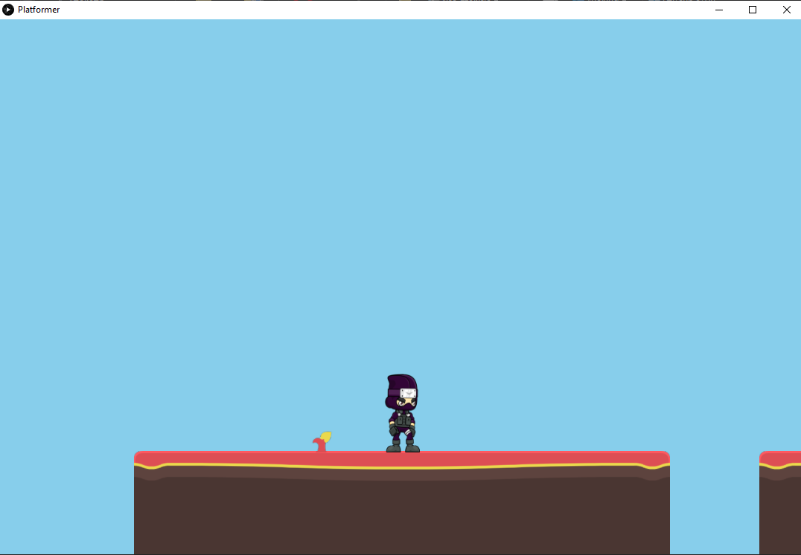

# Assignment in Multimedia Technology (at AUEB 2020 - 2021)
  We were asked to make a Platformer game using Processing IDE.

  

### Participants
  * [Vasileios Mormoris](https://github.com/VMormoris)
  * [Nikolaos - Aristotelis Paterakis](https://github.com/PaterakisNikos)

### Prerequisites

  * You need [Processing IDE](https://processing.org/download) on your Computer
  * Box2D for Processing installed on the IDE
  * Processing Sound also installed on the IDE

  _In order to install the libraries on the IDE go to:_ 
  **Sketch** -- > **Import Library** -- > **Add Library** 
  _and search for the libraries mention above_
### Instructions

  Just like any other game press 'a' or 'd' to move left or right respectively and space to jump. Just be careful that you have chosen English as your keyboard language and that the Caps Lock button is not active.

### 3rd Party Libraries

  * Box2D for Processing by Shiffman (can be found [here](https://github.com/shiffman/Box2D-for-Processing))
  * Processing Sound by The Processing Foundation (can be found [here](https://github.com/processing/processing-sound))

### Artists

  * _[Abstract Platformer](https://www.kenney.nl/assets/abstract-platformer) by Kenney Vleugels ([Kenney.nl](https://www.kenney.nl/))_
  * _[Animated Ninja](https://www.gameart2d.com/ninja-adventure---free-sprites.html) by Game Art 2D_
  * _Background Music: [awesomeness.wav](https://opengameart.org/content/menu-music) by [mrpoly](https://opengameart.org/users/mrpoly)_
  * _Death Sound: [ouch.wav](https://opengameart.org/content/hurt-death-sound-effect-for-character) by [Badre-Eddine](https://opengameart.org/users/badre-eddine)_
